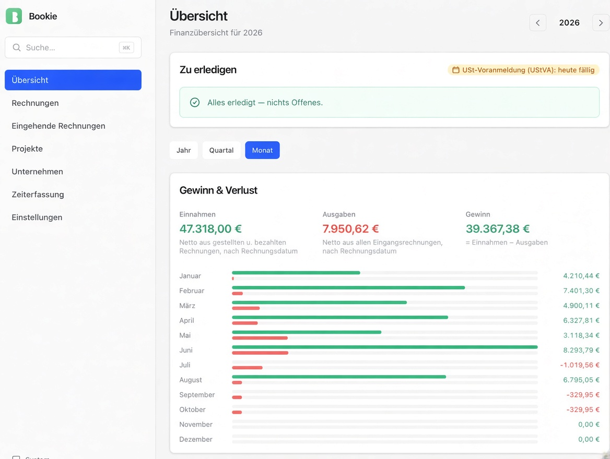
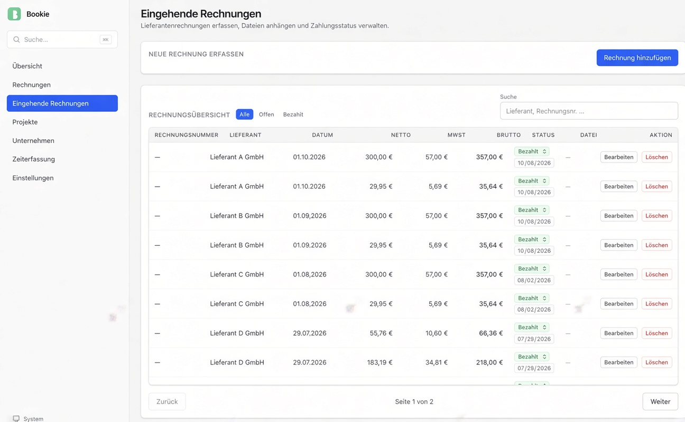
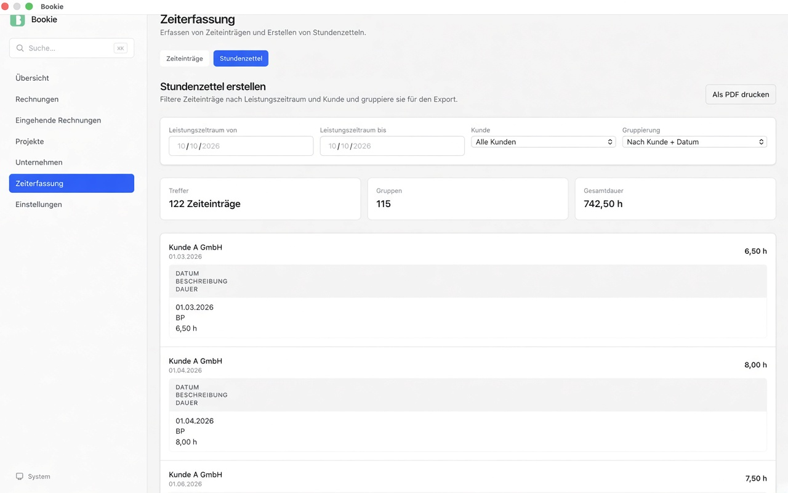
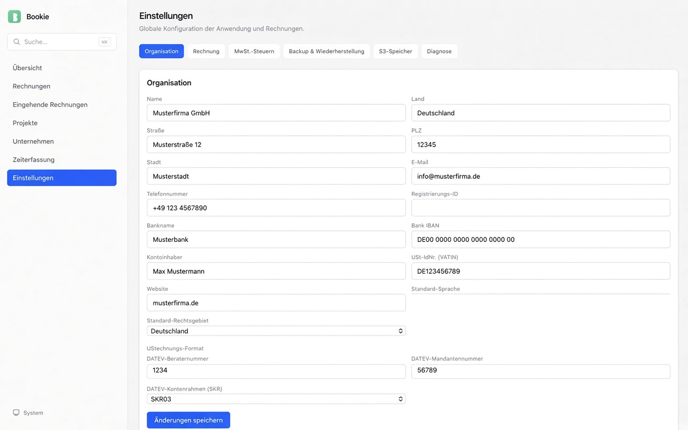

<p align="center">
  
</p>

<p align="center">
  <a href="https://github.com/logscale-it/bookie/releases/latest"></a>
  <a href="https://github.com/logscale-it/bookie/releases"></a>
  <a href="LICENSE.txt"></a>
  <a href="https://tauri.app"></a>
</p>

# Bookie

**Local-first invoicing & bookkeeping for German freelancers and small businesses.**
Free, open source, no subscription, no cloud required. ~6 MB.

[⬇ Download for Windows / macOS / Linux](https://github.com/logscale-it/bookie/releases/latest) · [🇩🇪 Deutsch](README.de.md)

<p align="center"></p>

A free, offline alternative to subscription invoicing tools like lexoffice or sevDesk.

### Why Bookie?

- 🧾 Create invoices with country-specific mandatory fields (profiles for DE, AT, CH, FR, NL, US)
- 🔒 100% local: your data stays on your machine (SQLite)
- 📊 Dashboard for revenue and profit/loss
- ⏱ Built-in time tracking
- 💾 Backups, with optional S3 sync
- 🪶 Tiny: ~6 MB, built with Tauri + Svelte

## Download & install

Get the installer for your system from the [latest release](https://github.com/logscale-it/bookie/releases/latest):

- **Windows:** `.msi` or `.exe`
- **macOS:** `.dmg` (Apple Silicon)
- **Linux:** `.AppImage` or `.deb`

Bookie updates itself from GitHub Releases.

### "Unknown publisher" / "can't be opened" warnings

Bookie is not yet code-signed, so your OS may warn you. The app is open source and you can inspect or build it yourself.

- **Windows (SmartScreen):** click **More info** → **Run anyway**.
- **macOS (Gatekeeper):** right-click the app → **Open** → **Open**. Or: System Settings → Privacy & Security → scroll down → **Open Anyway**.
- **Linux:** `chmod +x Bookie*.AppImage`, then run it.

## Screenshots

| | |
|---|---|
|  |  |
|  | |

## Roadmap

- E-Rechnung (XRechnung / ZUGFeRD): receiving and creating, in progress, see [docs/e-rechnung-status.md](docs/e-rechnung-status.md)
- English UI and more jurisdictions, see the open issues labelled `help wanted`
- _Planned:_ a managed cloud version for a small fee. It would offer the same features as the S3 backup without setting up your own bucket.

## Development

Prerequisites: [Rust](https://rustup.rs) (stable), [Bun](https://bun.sh), and the [Tauri system dependencies](https://v2.tauri.app/start/prerequisites/) for your OS. Exact packages are listed in [CONTRIBUTING.md](CONTRIBUTING.md).

```bash
bun install          # install dependencies
bun run tauri dev    # run in dev mode
bun run tauri build  # production build
```

## Contributing

See [CONTRIBUTING.md](CONTRIBUTING.md). Look for [`good first issue`](https://github.com/logscale-it/bookie/labels/good%20first%20issue)s. Help with other languages and jurisdictions, and with performance and bundle size, is very welcome.

## License

MIT, see [LICENSE.txt](LICENSE.txt).
